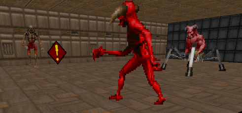

# realm-of-terror
- Doom Mod Still in alpha.
- Only the first episode is in development at the moment

## Contents
1. [Information](#information)
2. [Overview](#overview)
3. [Features](#features)
-    a.  [Compatibility](#compatibility)
-    b.  [Difficulty](#difficulty)
-    c.  [New Items](#new-items)
-    d.  [New Enemies](#new-enemies)
-    e.  [New Weapons & Textures](#new-weapons--textures)
-    f.  [Unique Environments & Puzzles](#unique-environments--puzzles)
-    g.  [GZDoom Features](#gzdoom-features)

## Information
- This mod started as a vanilla style mod, however it has become a transformative project which will feature up to 3 episodes. 
- Maps in the [UDMF](https://zdoom.org/wiki/Universal_Doom_Map_Format) format.
- Using the OTEX texture pack from [Here](https://www.doomworld.com/forum/topic/103426-otex-texture-set-%E2%80%93-update-2020-version-11-released/)
- Also using MANY assets from [Realm667](https://www.realm667.com/)
- Requires Doom, Doom 2, Plutonia or TNT WAD's to run.
- Tested using GZDoom
- Compatible with GZDoom Only, recommended 4.10.0 and newer
- Get [GZDoom](https://www.zdoom.org/downloads)

## Overview
Realm of Terror is about a spacial anomoly where Deimos is still intact, and the demons have been regrouping and planning yet another suprise attack. Luckily you, The Marine, find yourself on a collision course with this space time anomoly, and discover the plot before its too late. But can you thwart the demons this time?

## Features

- Below is a showcase of the features contained within the new mod...

### Compatibility

- Realm of Terror is compatible with ALL doom wads
    - Doom, Doom2, TNT & Plutonia

### Difficulty

- Difficulties are made more interesting by: 
    - making the enemies tougher and more aggressive
    - reducing ammo, health and armor capacity 
    - reducing drops from enemies
    - Allow respawning only on easy difficulties
    - disables monster in fighting on highest difficulty

### New Items

- Unique new items such as HP and Armor Grails
- New Ammo Bag and Rucksack
- Other consumables from Realm667

### New Enemies

- Many Enemies from Realm667
- Each enemie has been customized and is unique to Realm of Terror
- Total conversion of DECORATE to ZScript

### New Weapons & Textures

- New textures from OTEX texture pack
- Stunning new environments to explore

### Unique Environments & Puzzles

- Interesting puzzles and labyrinthian maps to traverse

### GZDoom Features

- Fully takes advantage of GZDoom specific features such as crouching and jumping

